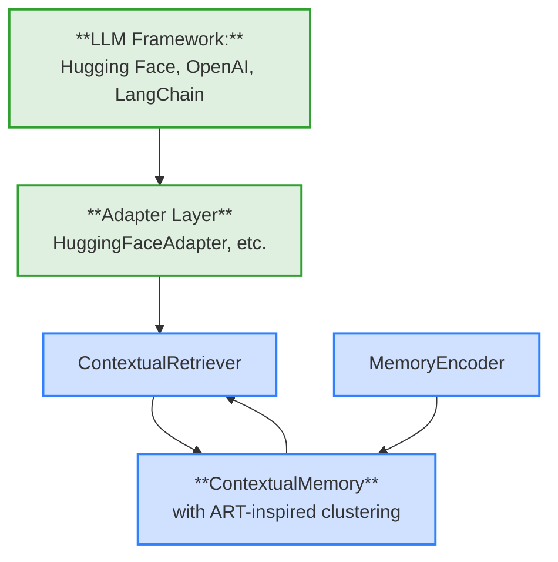
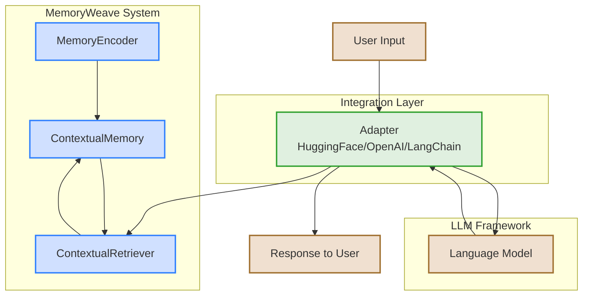
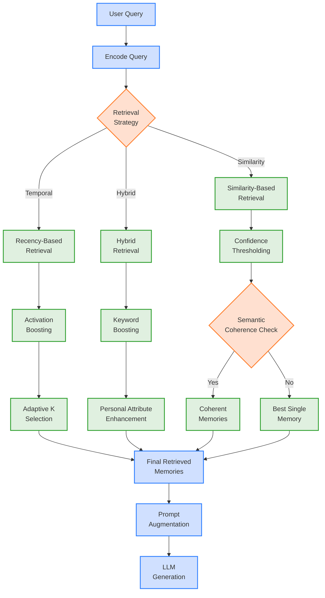
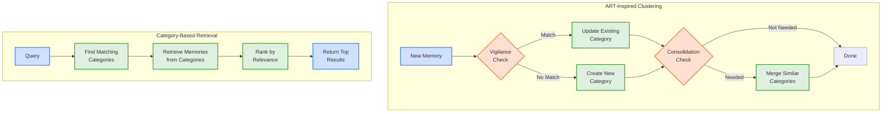

# MemoryWeave

MemoryWeave is an experimental approach to memory management for language models that uses a "contextual fabric" approach inspired by biological memory systems. Rather than traditional knowledge graph approaches with discrete nodes and edges, MemoryWeave focuses on capturing rich contextual signatures of information for improved long-context coherence in LLM conversations.

> **Note:** This project is in early development and is not yet ready for production use.

## Table of Contents
- [Key Concepts](#key-concepts)
- [Installation](#installation)
- [Basic Usage](#basic-usage)
- [Architecture](#architecture)
- [Examples & Notebooks](#examples)
- [Current Limitations](#current-limitations)
- [Contributing](#contributing)

## Key Concepts
<a id="key-concepts"></a>

MemoryWeave implements several biologically-inspired memory management principles:

- **Contextual Fabric**: Memory traces capture rich contextual signatures rather than isolated facts
- **Activation-Based Retrieval**: Memory retrieval uses dynamic activation patterns similar to biological systems
- **Episodic Structure**: Memories maintain temporal relationships and episodic anchoring
- **Non-Structured Memory**: Works with raw LLM outputs without requiring structured formats
- **ART-Inspired Clustering**: Optional memory categorization based on Adaptive Resonance Theory

<details>
<summary><strong>More about the contextual fabric approach</strong></summary>

Traditional LLM memory systems often rely on vector databases with discrete entries, losing much of the rich contextual information that helps humans navigate memories effectively. MemoryWeave attempts to address this by:

1. **Contextual Encoding**: Memories include surrounding context and metadata
2. **Activation Dynamics**: Recently or frequently accessed memories have higher activation levels
3. **Temporal Organization**: Memories maintain their relationship to other events in time
4. **Associative Retrieval**: Memories can be retrieved through multiple pathways beyond simple similarity
5. **Dynamic Categorization**: Memories self-organize into categories using ART-inspired clustering

This allows for more nuanced and effective memory retrieval during conversations, especially over long contexts or multiple sessions.
</details>

## Installation
<a id="installation"></a>

```bash
# Using uv (recommended)
uv add memoryweave

# Using pip
pip install memoryweave
```

## Basic Usage
<a id="basic-usage"></a>

```python
import torch
from transformers import AutoModel, AutoTokenizer, AutoModelForCausalLM

# Define a wrapper for embedding model
class EmbeddingModelWrapper:
    def __init__(self, model, tokenizer):
        self.model = model
        self.tokenizer = tokenizer
        
    def encode(self, text):
        inputs = self.tokenizer(text, return_tensors="pt", padding=True, truncation=True, max_length=512)
        with torch.no_grad():
            outputs = self.model(**inputs)
            
        # Mean pooling
        attention_mask = inputs["attention_mask"]
        embeddings = outputs.last_hidden_state
        mask = attention_mask.unsqueeze(-1).expand(embeddings.size()).float()
        masked_embeddings = embeddings * mask
        summed = torch.sum(masked_embeddings, 1)
        counts = torch.clamp(mask.sum(1), min=1e-9)
        mean_pooled = summed / counts
        
        return mean_pooled.numpy()[0]

# Load models
TOKENIZER_MODEL = "sentence-transformers/all-MiniLM-L6-v2"
LLM_MODEL = "TinyLlama/TinyLlama-1.1B-Chat-v1.0"

tokenizer = AutoTokenizer.from_pretrained(TOKENIZER_MODEL)
model = AutoModel.from_pretrained(TOKENIZER_MODEL)
embedding_model = EmbeddingModelWrapper(model, tokenizer)
llm_tokenizer = AutoTokenizer.from_pretrained(LLM_MODEL)
llm_model = AutoModelForCausalLM.from_pretrained(LLM_MODEL)

# Initialize memory components with ART clustering
from memoryweave.core import ContextualMemory, MemoryEncoder, ContextualRetriever
from memoryweave.integrations import HuggingFaceAdapter

memory = ContextualMemory(
    embedding_dim=384,  # Matches the embedding dimension of MiniLM-L6
    use_art_clustering=True,
    vigilance_threshold=0.85
)

encoder = MemoryEncoder(embedding_model)
retriever = ContextualRetriever(memory, embedding_model)
memory_system = dict(
    memory=memory,
    encoder=encoder,
    retriever=retriever
)

# Create adapter
adapter = HuggingFaceAdapter(
    memory_system=memory_system,
    model=llm_model,
    tokenizer=llm_tokenizer
)

# Generate with memory augmentation
response = adapter.generate(
    user_input="What do you know about neural networks?",
    conversation_history=[]
)
```

## Architecture
<a id="architecture"></a>

MemoryWeave uses a modular architecture with three main components:

1. **ContextualMemory**: Stores embeddings and metadata with activation levels
2. **MemoryEncoder**: Converts different content types into rich memory representations
3. **ContextualRetriever**: Retrieves memories using context-aware strategies

<details>
<summary><strong>Architecture diagram</strong></summary>




</details>

<details>
<summary><strong>Memory retrieval mechanism</strong></summary>




</details>

## Examples & Notebooks
<a id="examples"></a>

Check out the following examples and notebooks to get started:

### Examples
- `memoryweave/examples/basic_usage.py`: Basic memory operations
- `memoryweave/examples/integration_example.py`: Integration with LLM frameworks

### Notebooks
- `notebooks/test_memory.py`: Basic memory operations
- `notebooks/test_confidence_thresholding.py`: Demonstration of confidence thresholding
- `notebooks/test_category_consolidation.py`: Testing category consolidation
- `notebooks/test_dynamic_vigilance.py`: Demonstration of dynamic vigilance strategies
- `notebooks/test_large_memory_clustering.py`: Testing with larger memory collections
- `notebooks/benchmark_memory.py`: Benchmark different memory configurations

Results from the tests and benchmarks are stored in the `output/` directory.

## Current Limitations
<a id="current-limitations"></a>

This project is in early development and has several limitations:

- Limited testing with large-scale models
- No persistence layer for long-term storage
- Basic interface that will likely change
- Performance not yet optimized for large memory stores

## Contributing
<a id="contributing"></a>

Contributions are welcome! Since this is an early-stage project, please open an issue first to discuss what you'd like to change.

1. Fork the repository
2. Create your feature branch (`git checkout -b feature/amazing-feature`)
3. Commit your changes (`git commit -m 'Add some amazing feature'`)
4. Push to the branch (`git push origin feature/amazing-feature`)
5. Open a Pull Request

## Development
<a id="development"></a>

This project uses `uv` for package management:

```bash
# Install in development mode
uv pip install -e .

# Run a script
uv run python script_name.py

# Run tests
uv run python -m pytest
```

Check the [ROADMAP.md](ROADMAP.md) file for planned future developments.