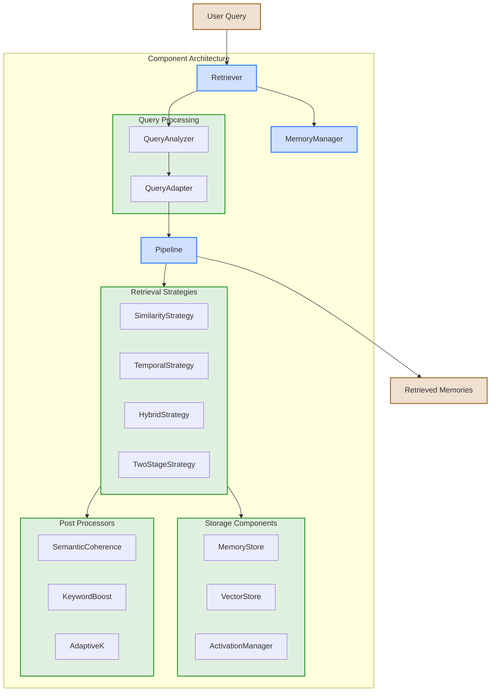

# MemoryWeave

MemoryWeave is an experimental approach to memory management for language models that uses a "contextual fabric" approach inspired by biological memory systems. Rather than traditional knowledge graph approaches with discrete nodes and edges, MemoryWeave focuses on capturing rich contextual signatures of information for improved long-context coherence in LLM conversations.

> **Note:** This project has undergone a major architectural refactoring to a component-based design. See the [Migration Guide](docs/MIGRATION_GUIDE.md) for details on transitioning from the legacy architecture.

## Table of Contents
- [Key Concepts](#key-concepts)
- [Architecture](#architecture)
- [Installation](#installation)
- [Quick Start](#quick-start)
- [Benchmarks](#benchmarks)
- [Current Limitations](#current-limitations)
- [Roadmap](#roadmap)
- [Contributing](#contributing)

## Key Concepts
<a id="key-concepts"></a>

MemoryWeave implements several biologically-inspired memory management principles:

- **Contextual Fabric**: Memory traces capture rich contextual signatures rather than isolated facts
- **Activation-Based Retrieval**: Memory retrieval uses dynamic activation patterns similar to biological systems
- **Episodic Structure**: Memories maintain temporal relationships and episodic anchoring
- **Non-Structured Memory**: Works with raw LLM outputs without requiring structured formats
- **ART-Inspired Clustering**: Optional memory categorization based on Adaptive Resonance Theory

<details>
<summary><strong>More about the contextual fabric approach</strong></summary>

Traditional LLM memory systems often rely on vector databases with discrete entries, losing much of the rich contextual information that helps humans navigate memories effectively. MemoryWeave attempts to address this by:

1. **Contextual Encoding**: Memories include surrounding context and metadata
2. **Activation Dynamics**: Recently or frequently accessed memories have higher activation levels
3. **Temporal Organization**: Memories maintain their relationship to other events in time
4. **Associative Retrieval**: Memories can be retrieved through multiple pathways beyond simple similarity
5. **Dynamic Categorization**: Memories self-organize into categories using ART-inspired clustering

This allows for more nuanced and effective memory retrieval during conversations, especially over long contexts or multiple sessions.
</details>

## Architecture
<a id="architecture"></a>

MemoryWeave uses a component-based architecture with several modular pieces that can be configured for different use cases:

### Core Components

1. **Memory Management**
   - `MemoryManager`: Coordinates memory operations and component interactions
   - `MemoryStore`: Stores embeddings, content, and metadata
   - `VectorStore`: Handles vector similarity search and indexing
   - `ActivationManager`: Manages memory activation levels

2. **Retrieval Strategies**
   - `SimilarityRetrievalStrategy`: Pure vector similarity-based retrieval
   - `TemporalRetrievalStrategy`: Time and recency-based retrieval
   - `HybridRetrievalStrategy`: Combines similarity and temporal retrieval
   - `TwoStageRetrievalStrategy`: Advanced multi-stage retrieval process
   
3. **Query Processing**
   - `QueryAnalyzer`: Analyzes and classifies query types
   - `QueryAdapter`: Adapts retrieval parameters based on query
   - `PersonalAttributeManager`: Extracts and manages personal attributes

4. **Post-Processing**
   - `SemanticCoherenceProcessor`: Ensures retrieved memories are coherent
   - `KeywordBoostProcessor`: Enhances keyword-relevant memories
   - `AdaptiveKProcessor`: Dynamically adjusts number of results

5. **Pipeline System**
   - `PipelineBuilder`: Constructs configurable processing pipelines
   - `ComponentRegistry`: Manages component registration and access

<details>
<summary><strong>Component Architecture Diagram</strong></summary>

```mermaid
flowchart TD
    LLM["**LLM Framework:**<br>Hugging Face, OpenAI, LangChain"] --> Adapter
    Adapter["**Adapter Layer**<br>HuggingFaceAdapter, etc."] --> Retriever
    
    subgraph Components[Component Architecture]
        Retriever[Retriever] --> MemMgr[MemoryManager]
        MemMgr --> Components
        
        subgraph Components[Component Registry]
            MemStore[MemoryStore]
            VecStore[VectorStore]
            ActMgr[ActivationManager]
            QAnalyzer[QueryAnalyzer]
            QAdapter[QueryAdapter]
            RetStrats[Retrieval Strategies]
            PostProcs[Post Processors]
            PipeBuilder[Pipeline Builder]
        end
    end
    
    MemMgr --> Pipeline[Configured Pipeline]
    Pipeline --> Results[Retrieved Memories]
    Results --> Adapter
    
    classDef primary fill:#d0e0ff,stroke:#3080ff,stroke-width:2px
    classDef secondary fill:#e0f0e0,stroke:#30a030,stroke-width:2px
    
    class MemMgr,Retriever,Pipeline primary
    class Components,LLM,Adapter,Results secondary
```


</details>

<details>
<summary><strong>Memory retrieval mechanism</strong></summary>


</details>

## Installation
<a id="installation"></a>

MemoryWeave is available as a Python package:

```bash
# Using UV (recommended)
uv pip install memoryweave

# Using pip
pip install memoryweave
```

For development install:

```bash
# Clone the repository
git clone https://github.com/yourusername/memoryweave.git
cd memoryweave

# Install in development mode
uv pip install -e .

# Install development dependencies
uv pip install -g dev
```

## Quick Start
<a id="quick-start"></a>

Here's a simple example of using MemoryWeave with the new component architecture:

```python
from memoryweave.components import Retriever
from memoryweave.components.memory_manager import MemoryManager
from sentence_transformers import SentenceTransformer

# Initialize embedding model
embedding_model = SentenceTransformer("all-MiniLM-L6-v2")

# Create memory manager
memory_manager = MemoryManager()

# Create retriever
retriever = Retriever(memory=memory_manager, embedding_model=embedding_model)

# Configure retriever (optional)
retriever.configure_query_type_adaptation(enable=True)
retriever.configure_two_stage_retrieval(enable=True)
retriever.initialize_components()

# Add some memories
texts = [
    "My favorite color is blue.",
    "I visited Paris last summer.",
    "Python is a programming language created by Guido van Rossum."
]

for text in texts:
    embedding = embedding_model.encode(text)
    memory_manager.add_memory(embedding, text)

# Retrieve memories based on a query
query = "What programming languages do I know?"
results = retriever.retrieve(query, top_k=3)

# Process results
for result in results:
    print(f"Score: {result['relevance_score']:.4f} - {result['content']}")
```

See the [examples](examples/) directory for more detailed examples and the [Migration Guide](docs/MIGRATION_GUIDE.md) for transitioning from the legacy architecture.

## Benchmarks
<a id="benchmarks"></a>

MemoryWeave includes a benchmarking tool to evaluate and compare different retrieval configurations:

```bash
# Run benchmarks
uv run python -m benchmarks.memory_retrieval_benchmark
```

Current benchmark results show the following metrics across different configurations:

| Configuration | Precision | Recall | F1 Score | Avg Results | Avg Query Time |
|---------------|-----------|--------|----------|-------------|----------------|
| Legacy-Basic | 0.004 | 0.015 | 0.006 | 10.0 | 0.0083s |
| Components-Advanced | 0.004 | 0.015 | 0.006 | 10.0 | 0.0084s |
| Optimized-Performance | 0.004 | 0.015 | 0.006 | 10.0 | 0.0085s |

These benchmarks help ensure that the new component architecture maintains performance parity with the legacy implementation.

## Current Limitations
<a id="current-limitations"></a>

While MemoryWeave has undergone significant architectural improvements, there are still some limitations:

- ART-Clustering feature is not fully implemented in the component architecture
- Limited testing with large-scale models and large memory stores
- No persistence layer for long-term storage
- Query analyzer needs improvements for certain query types
- Performance could be further optimized for large memory sets

## Roadmap
<a id="roadmap"></a>

See the [ROADMAP.md](ROADMAP.md) file for detailed information on planned developments. Current priorities include:

- Complete implementation of ART-Clustering in component architecture
- Fix and improve query analyzer accuracy
- Add persistence layer for long-term memory storage
- Optimize performance for large memory sets
- Improve benchmarking methodology

Check the [feature matrix](docs/feature_matrix.md) for the current implementation status of various features.

## Contributing
<a id="contributing"></a>

Contributions are welcome! Please check our [documentation](docs/) first to understand the project's architecture and current state.

1. Fork the repository
2. Create your feature branch (`git checkout -b feature/amazing-feature`)
3. Commit your changes (`git commit -m 'Add some amazing feature'`)
4. Push to the branch (`git push origin feature/amazing-feature`)
5. Open a Pull Request

## Development
<a id="development"></a>

This project uses `uv` for package management:

```bash
# Install in development mode
uv pip install -e .

# Install development dependencies
uv pip install -g dev

# Run tests
uv run python -m pytest

# Run just unit tests
uv run python -m pytest -m unit

# Run type checking and linting
uv run mypy memoryweave/
uv run ruff check memoryweave/

# Format code
uv run ruff format memoryweave/
```

## Documentation

For more detailed information, check out these additional resources:

- [Migration Guide](docs/MIGRATION_GUIDE.md): How to migrate from legacy to component architecture
- [Feature Matrix](docs/feature_matrix.md): Current implementation status of features
- [Implementation Constraints](docs/implementation_constraints.md): Known limitations and constraints
- [Refactoring Progress](docs/refactoring_progress.md): Summary of architectural refactoring progress
- [Plan for Improvement](docs/plan_for_improvement.md): Detailed plan for addressing current issues