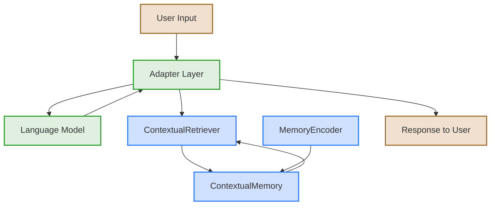
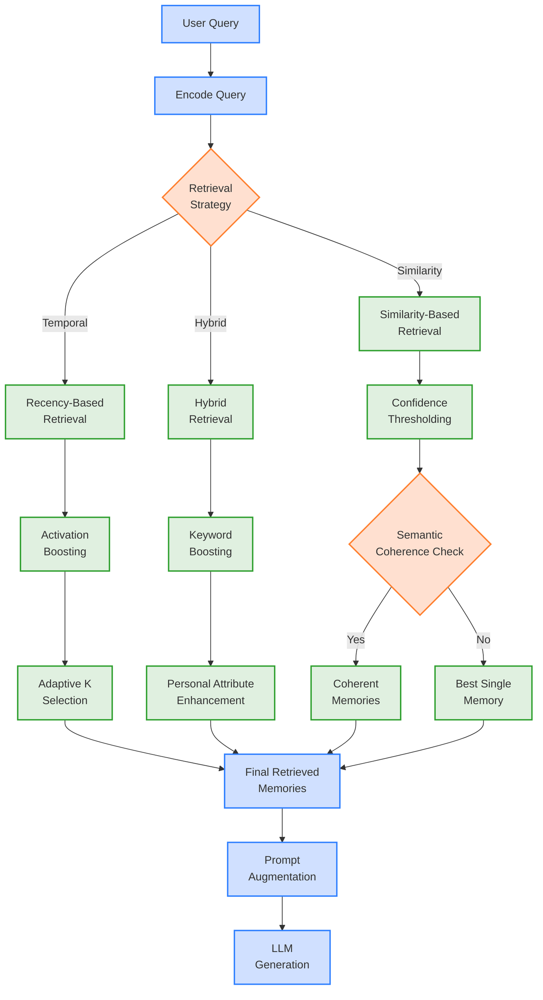
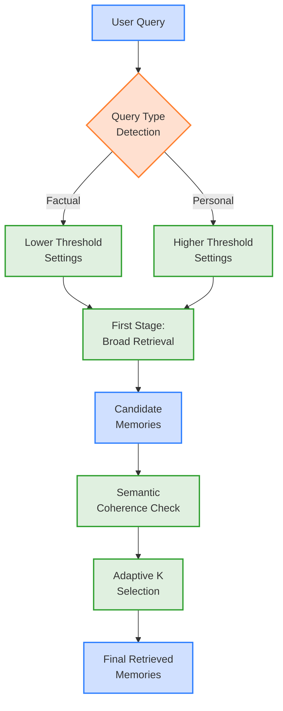
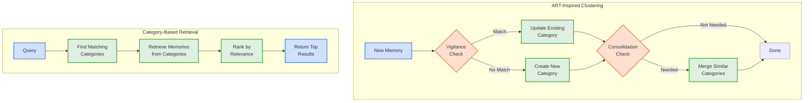

# MemoryWeave Project Knowledge

## Project Overview
MemoryWeave is a novel approach to memory management for language models that uses a "contextual fabric" approach inspired by biological memory systems. Instead of traditional knowledge graph approaches with discrete nodes and edges, MemoryWeave focuses on capturing rich contextual signatures of information for improved long-context coherence in language model conversations.

## Key Features
- **Contextual Fabric**: Memory traces capture rich contextual signatures rather than isolated facts
- **Activation-Based Retrieval**: Memory retrieval uses dynamic activation patterns similar to biological systems
- **Episodic Structure**: Memories maintain temporal relationships and episodic anchoring
- **Non-Structured Memory**: Works with raw LLM outputs without requiring structured formats
- **Modular Architecture**: Easily integrates with existing LLM inference frameworks
- **ART-Inspired Clustering**: Optional Adaptive Resonance Theory inspired memory categorization

## Project Structure
- `memoryweave/core/`: Core components of the memory system
- `memoryweave/integrations/`: Adapters for various LLM frameworks
- `memoryweave/evaluation/`: Metrics and tools for evaluating performance
- `memoryweave/examples/`: Example usage patterns
- `memoryweave/utils/`: Utility functions

## Dependencies
- Python 3.12+
- Key packages: faiss-cpu, huggingface-hub, numpy, pydantic, torch, transformers

## Development Guidelines
- Follow PEP 8 style guidelines
- Include docstrings for all public functions and classes
- Write unit tests for new functionality

## Working with this Repository
- Use `uv` for package management and running Python scripts
- Install the package in development mode with: `uv pip install -e .`
- Run Python scripts with: `uv run python script_name.py`
- Run tests with: `uv run python -m pytest`

## Important Implementation Notes
- Hugging Face models require a wrapper class that provides an `encode` method, as they don't have this method natively
- The `EmbeddingModelWrapper` class should be used to wrap Hugging Face models for use with MemoryWeave
- The wrapper handles tokenization, model inference, and mean pooling to create sentence embeddings

## Enhanced Retrieval Mechanisms
MemoryWeave implements several advanced retrieval mechanisms to improve memory recall:

### Two-Stage Retrieval
- **First Stage**: Retrieve a larger set of candidate memories (20-30) with a lower threshold
- **Second Stage**: Re-rank and filter candidates using semantic coherence and adaptive K selection
- Significantly improves recall for factual queries while maintaining precision for personal queries

### Query Type Adaptation
- Automatically adapts retrieval parameters based on query type:
  - **Factual Queries**: Lower thresholds and less conservative adaptive K selection
  - **Personal Queries**: Higher thresholds for better precision
- Detection based on pattern matching and presence/absence of personal pronouns

### Dynamic Threshold Adjustment
- Automatically adjusts confidence thresholds based on retrieval performance
- Monitors metrics over a sliding window of recent interactions
- Self-tuning mechanism that adapts to different conversation contexts

### Memory Decay
- Applies exponential decay to memory activations over time
- Helps focus on recent and contextually relevant memories
- Reduces the need for manual memory consolidation

## Performance Optimization
For optimal performance with MemoryWeave:

1. **Balance Precision and Recall**:
   - For personal assistants: Use higher thresholds (0.3-0.4) and enable semantic coherence
   - For knowledge retrieval: Use lower thresholds (0.15-0.25) and enable query type adaptation

2. **Adaptive K Selection**:
   - More conservative (0.3): Fewer but higher quality memories
   - Less conservative (0.15): More memories with potentially lower relevance
   - Balanced (0.2): Good compromise for most applications

3. **Memory Consolidation**:
   - Enable category consolidation for long-running conversations
   - Use memory decay for gradual focus shift to recent information

## Architecture Diagrams
The project architecture can be visualized with the following diagrams:

### High-Level System Architecture

### Memory Retrieval Mechanism

### Enhanced Two-Stage Retrieval

### ART-Inspired Clustering

