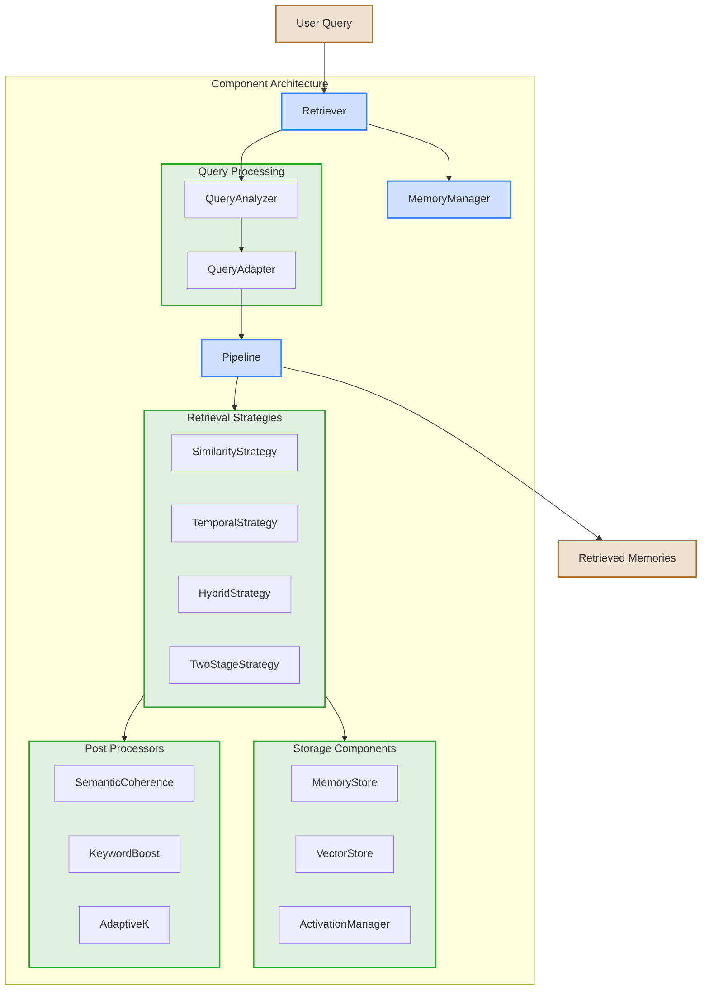
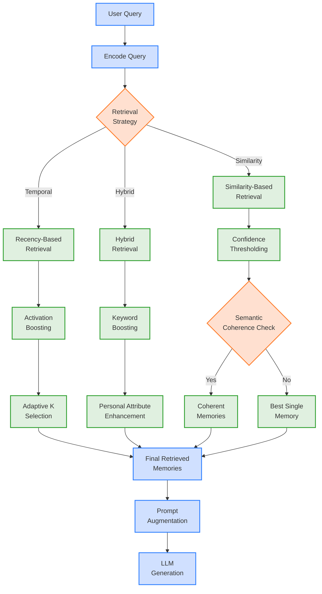
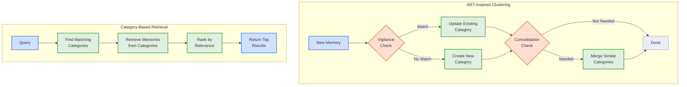

# MemoryWeave

MemoryWeave is a flexible memory management system for Large Language Models (LLMs), featuring a modular component-based architecture that enables rich contextual retrieval and adaptive memory processing.

> **Note:** This project has undergone a major architectural refactoring to a component-based design. See the [Migration Guide](docs/MIGRATION_GUIDE.md) for details on transitioning from the legacy architecture.

## Table of Contents

- [Key Concepts](#key-concepts)
- [Architecture](#architecture)
- [Installation](#installation)
- [Quick Start](#quick-start)
- [Benchmarks](#benchmarks)
- [Current Limitations](#current-limitations)
- [Roadmap](#roadmap)
- [Contributing](#contributing)

## Key Concepts

<a id="key-concepts"></a>

MemoryWeave implements several biologically-inspired memory management principles:

- **Contextual Fabric**: Memory traces capture rich contextual signatures rather than isolated facts
- **Activation-Based Retrieval**: Memory retrieval uses dynamic activation patterns similar to biological systems
- **Episodic Structure**: Memories maintain temporal relationships and episodic anchoring
- **Non-Structured Memory**: Works with raw LLM outputs without requiring structured formats
- **ART-Inspired Clustering**: Optional memory categorization based on Adaptive Resonance Theory

<details>
<summary><strong>More about the contextual fabric approach</strong></summary>

Traditional LLM memory systems often rely on vector databases with discrete entries, losing much of the rich contextual information that helps humans navigate memories effectively. MemoryWeave attempts to address this by:

1. **Contextual Encoding**: Memories include surrounding context and metadata
1. **Activation Dynamics**: Recently or frequently accessed memories have higher activation levels
1. **Temporal Organization**: Memories maintain their relationship to other events in time
1. **Associative Retrieval**: Memories can be retrieved through multiple pathways beyond simple similarity
1. **Dynamic Categorization**: Memories self-organize into categories using ART-inspired clustering

This allows for more nuanced and effective memory retrieval during conversations, especially over long contexts or multiple sessions.

</details>

## Architecture

<a id="architecture"></a>

MemoryWeave uses a component-based architecture that enables flexible composition of memory management pipelines:

- **Components**: Modular building blocks that can be combined into retrieval pipelines
- **Memory Storage**: Flexible storage backends including vector stores and hybrid solutions
- **Retrieval Strategies**: Various approaches for retrieving relevant memories
- **Context Enhancement**: Rich contextual processing of embeddings and queries
- **Post-Processing**: Fine-tuning of retrieval results based on various signals

### Core Components

1. **Memory Management**

   - `MemoryManager`: Coordinates memory operations and component interactions
   - `MemoryStore`: Stores embeddings, content, and metadata
   - `VectorStore`: Handles vector similarity search and indexing
   - `ActivationManager`: Manages memory activation levels

1. **Retrieval Strategies**

   - `SimilarityRetrievalStrategy`: Pure vector similarity-based retrieval
   - `TemporalRetrievalStrategy`: Time and recency-based retrieval
   - `HybridRetrievalStrategy`: Combines similarity and temporal retrieval
   - `TwoStageRetrievalStrategy`: Advanced multi-stage retrieval process

1. **Query Processing**

   - `QueryAnalyzer`: Analyzes and classifies query types
   - `QueryAdapter`: Adapts retrieval parameters based on query
   - `PersonalAttributeManager`: Extracts and manages personal attributes

1. **Post-Processing**

   - `SemanticCoherenceProcessor`: Ensures retrieved memories are coherent
   - `KeywordBoostProcessor`: Enhances keyword-relevant memories
   - `AdaptiveKProcessor`: Dynamically adjusts number of results

1. **Pipeline System**

   - `PipelineBuilder`: Constructs configurable processing pipelines
   - `ComponentRegistry`: Manages component registration and access

<details>
<summary><strong>Component Architecture Diagram</strong></summary>

```mermaid
flowchart TD
    LLM["**LLM Framework:**<br>Hugging Face, OpenAI, LangChain"] --> Adapter
    Adapter["**Adapter Layer**<br>HuggingFaceAdapter, etc."] --> Retriever
    
    subgraph Components[Component Architecture]
        Retriever[Retriever] --> MemMgr[MemoryManager]
        MemMgr --> Components
        
        subgraph Components[Component Registry]
            MemStore[MemoryStore]
            VecStore[VectorStore]
            ActMgr[ActivationManager]
            QAnalyzer[QueryAnalyzer]
            QAdapter[QueryAdapter]
            RetStrats[Retrieval Strategies]
            PostProcs[Post Processors]
            PipeBuilder[Pipeline Builder]
        end
    end
    
    MemMgr --> Pipeline[Configured Pipeline]
    Pipeline --> Results[Retrieved Memories]
    Results --> Adapter
    
    classDef primary fill:#d0e0ff,stroke:#3080ff,stroke-width:2px
    classDef secondary fill:#e0f0e0,stroke:#30a030,stroke-width:2px
    
    class MemMgr,Retriever,Pipeline primary
    class Components,LLM,Adapter,Results secondary
```



</details>

<details>
<summary><strong>Memory retrieval mechanism</strong></summary>





</details>

## Installation

<a id="installation"></a>

MemoryWeave is available as a Python package:

```bash
# Using UV (recommended)
uv pip install memoryweave

# Using pip
pip install memoryweave
```

For development install:

```bash
# Clone the repository
git clone https://github.com/yourusername/memoryweave.git
cd memoryweave

# Install in development mode
uv pip install -e .

# Install development dependencies
uv pip install -g dev
```

## Quick Start

<a id="quick-start"></a>

Here's a simple example of using MemoryWeave with the new component architecture:

```python
from memoryweave.components import MemoryEncoder, Retriever
from memoryweave.storage.refactored.memory_store import StandardMemoryStore
from sentence_transformers import SentenceTransformer

# Create components
embedding_model = SentenceTransformer("sentence-transformers/paraphrase-MiniLM-L6-v2")
store = StandardMemoryStore()
encoder = MemoryEncoder(embedding_model)
retriever = Retriever(memory=store, embedding_model=embedding_model)
retriever.initialize_components()

# Add memories
text1 = "MemoryWeave uses a component-based architecture for flexible memory management."
text2 = "Components can be combined into retrieval pipelines with various strategies."
embedding1 = encoder.encode_text(text1)
embedding2 = encoder.encode_text(text2)
memory_id1 = store.add(embedding1, text1)
memory_id2 = store.add(embedding2, text2)

# Retrieve memories
query = "How does MemoryWeave organize its code?"
results = retriever.retrieve(query, top_k=3)
for result in results:
    print(f"Score: {result['relevance_score']:.4f} - {result['content']}")
```

See the [examples](examples/) directory for more detailed examples and the [Migration Guide](docs/MIGRATION_GUIDE.md) for transitioning from the legacy architecture.

## Benchmarks

<a id="benchmarks"></a>

MemoryWeave includes comprehensive benchmarking tools to evaluate and compare different retrieval approaches, with special focus on the contextual fabric architecture.

### Contextual Fabric Benchmark

The most important benchmark compares the contextual fabric architecture with traditional retrieval methods:

```bash
# Run the complete benchmark suite with multiple memory sizes
./run_contextual_fabric_benchmark.sh

# Run with a specific memory size
uv run python -m benchmarks.contextual_fabric_benchmark --memories 100
```

This benchmark tests how well the contextual fabric architecture handles:

- Conversation context understanding
- Temporal reference resolution
- Associative memory linking
- Activation patterns
- Episodic memory retrieval

### Other Benchmarks

```bash
# Run baseline comparison (compare against BM25 and vector search)
uv run python run_baseline_comparison.py

# Run synthetic benchmark (evaluates different configurations)
uv run python run_synthetic_benchmark.py

# Run semantic benchmark (tests performance on real-world queries)
uv run python run_semantic_benchmark.py

# Run custom benchmark script
uv run python -m benchmarks.memory_retrieval_benchmark

# Visualize benchmark results
python examples/visualize_results.py synthetic_benchmark_results.json
```

Current benchmark results show significant improvements when using the contextual fabric approach:

| Memory Size | Hybrid BM25+Vector | Contextual Fabric | Improvement |
|-------------|-------------------|-------------------|-------------|
| 20 memories | 0.136 F1          | 0.290 F1          | +0.154 F1   |
| 100 memories | 0.056 F1         | 0.217 F1          | +0.161 F1   |
| 500 memories | 0.033 F1         | 0.075 F1          | +0.042 F1   |

For detailed information on running and interpreting benchmarks, see the [Benchmark Guide](docs/benchmark_guide.md).

## Current Limitations

<a id="current-limitations"></a>

While MemoryWeave has undergone significant architectural improvements, there are still some limitations:

- Limited testing with large-scale models and large memory stores
- No persistence layer for long-term storage
- Query analyzer needs improvements for certain query types
- ✅ Performance with large memory sets is now optimized through ANN implementation
- Vector retrieval performance in benchmarks lags behind BM25 for some query types
- Hybrid retrieval still needs tuning to combine BM25 and vector advantages

## Roadmap

<a id="roadmap"></a>

See the [ROADMAP.md](ROADMAP.md) file for detailed information on planned developments. Current priorities include:

- Fix and improve query analyzer accuracy
- Add persistence layer for long-term memory storage
- ✅ Optimize performance for large memory sets (implemented ANN search)
- Improve hybrid retrieval to combine BM25 and vector search advantages
- Expand benchmarking datasets for more diverse query types
- Implement visualization improvements for benchmark results
- Enhance vector retrieval precision while maintaining high recall

Check the [feature matrix](docs/feature_matrix.md) for the current implementation status of various features.

## Contributing

<a id="contributing"></a>

Contributions are welcome! Please check our [documentation](docs/) first to understand the project's architecture and current state.

1. Fork the repository
1. Create your feature branch (`git checkout -b feature/amazing-feature`)
1. Commit your changes (`git commit -m 'Add some amazing feature'`)
1. Push to the branch (`git push origin feature/amazing-feature`)
1. Open a Pull Request

### Developed with AI Assistance

This project is developed with assistance from AI tools, particularly Claude, to accelerate development, improve code quality, and automate testing. We believe in transparency about AI usage in our development process while maintaining high standards for all contributions.

## Development

<a id="development"></a>

This project uses `uv` for package management:

```bash
# Install in development mode
uv pip install -e .

# Install development dependencies
uv pip install -g dev

# Run tests
uv run python -m pytest

# Run just unit tests
uv run python -m pytest -m unit

# Run type checking and linting
uv run mypy memoryweave/
uv run ruff check memoryweave/

# Format code
uv run ruff format memoryweave/
```

## Documentation

For more detailed information, check out these additional resources:

- [Migration Guide](docs/MIGRATION_GUIDE.md): How to migrate from legacy to component architecture
- [Feature Matrix](docs/feature_matrix.md): Current implementation status of features
- [Implementation Constraints](docs/implementation_constraints.md): Known limitations and constraints
- [Refactoring Progress](docs/refactoring_progress.md): Summary of architectural refactoring progress
- [Plan for Improvement](docs/plan_for_improvement.md): Detailed plan for addressing current issues
